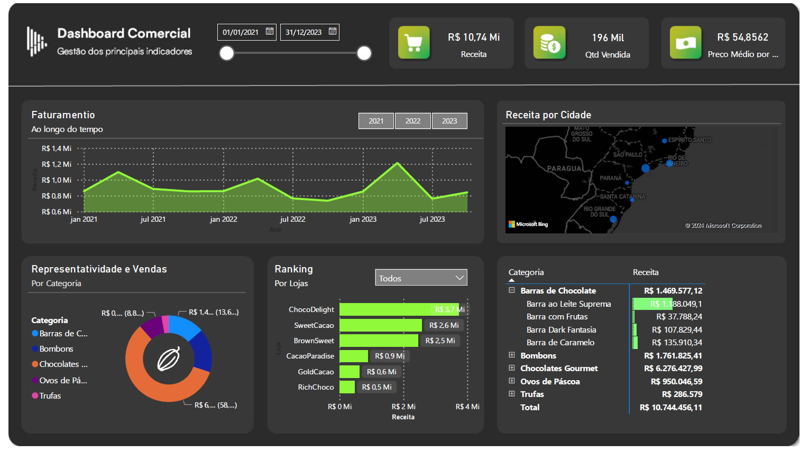

# Minicurso de Power BI

Este é um minicurso de Power Bi ministrado por Karine Lago e Letícia Smirelli. Este foi o dashboard criado neste curso.

As aulas estão disponíveis de forma gratuita neste linK:

https://minicursopowerbi.com.br/aulas/

Links compartilhados no curso:

Link Oficial Download Power BI Desktop (100% Gratuito)
https://powerbi.microsoft.com/pt-pt/desktop/

Site para encontrar ícones mencionados na aula
https://www.flaticon.com/br/

Minicurso de Figma para design de dashboards
https://www.youtube.com/watch?v=dphoDzhVgtQ

Link para criar conta gratuita e publicar seu relatório na web
https://www.youtube.com/watch?v=GpnuM47mAmg
